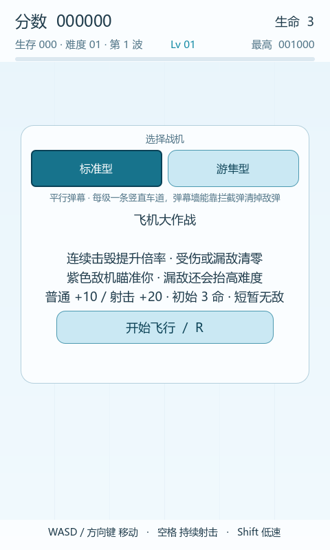
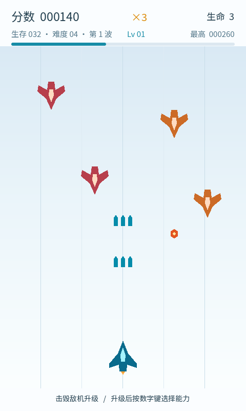
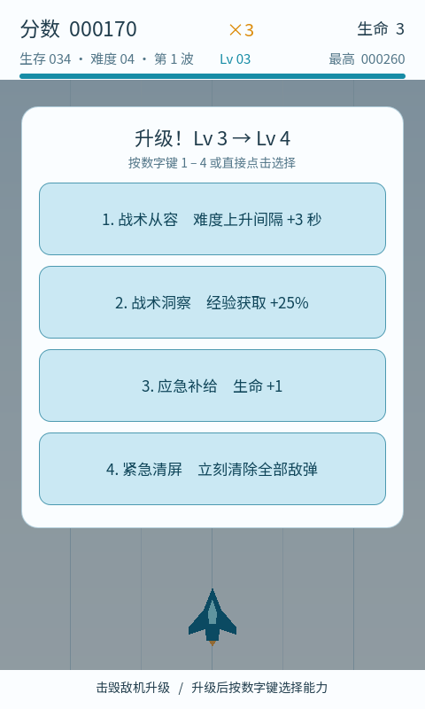
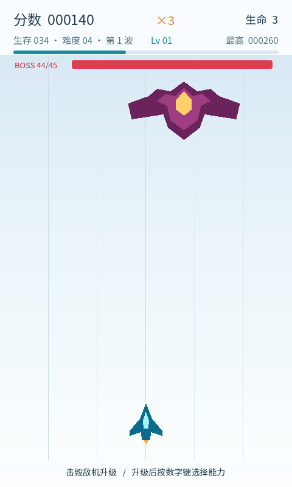
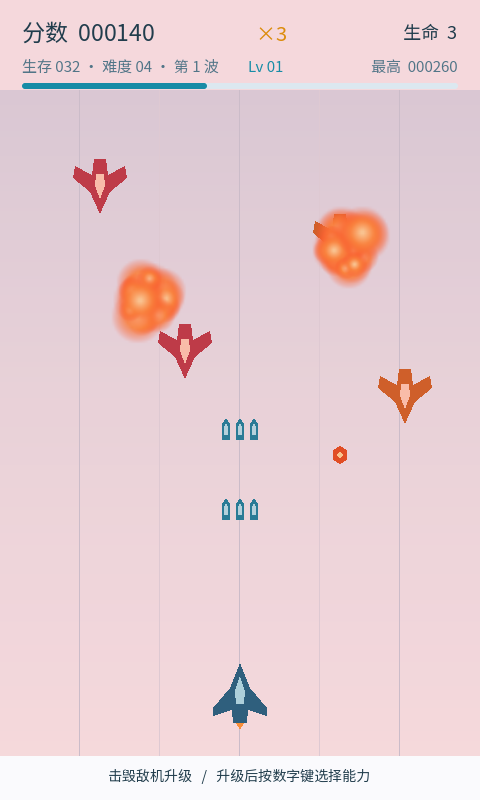
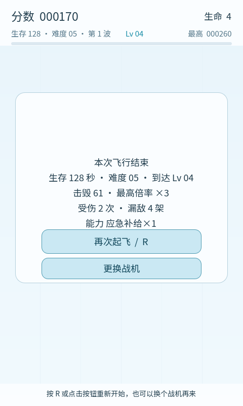
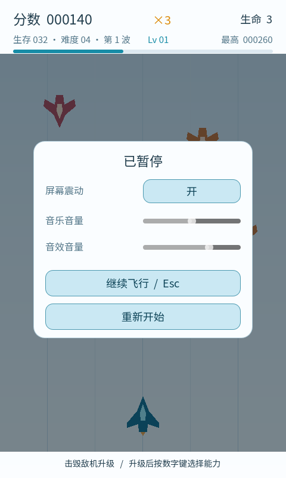
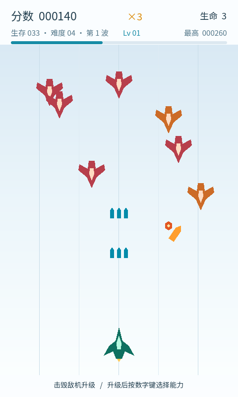
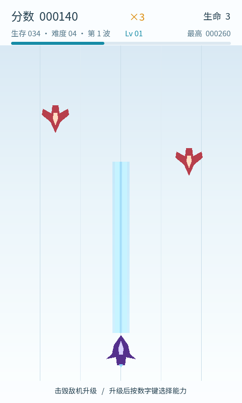

# 飞机大作战 · Flight School

480 × 800 竖版无尽生存射击原型。Godot 4.7.2 + GDScript。

**零外部美术与音频素材**——所有图形由内置多边形绘制，所有音效与背景音乐由 Python 脚本合成，仓库里没有任何一张图片或一段下载来的音源。唯一的第三方文件是 `assets/fonts/` 下那份 **SIL OFL 授权的中文字体子集**（Web 版没有系统字体可查，不留一份中文就全是方块），它同样是脚本产物：`tools/build_font.py` 从 Noto Sans SC 裁出界面真正用到的 823 个字，约 259 KB，许可证一并随包。

|  |  |
| --- | --- |
| 引擎 | Godot 4.7.2 stable（GL Compatibility 渲染器） |
| 分辨率 | 480 × 800，`canvas_items` 等比缩放 |
| 物理 | 120 Hz |
| 规模 | 10 个脚本 / 9 个场景 / 16 项能力 / 3 种战机形态 / 5 套波次编队 |
| 验证 | **475 项自动回归断言** + 压力基准 + 威胁基准 + 浸泡基准 + 追击基准，八个模式全绿 |
| 素材 | 7 段程序合成音频，0 个第三方文件 |

| 开始界面 | 战斗 |
| --- | --- |
|  |  |

| 升级抉择 | Boss 战 |
| --- | --- |
|  |  |

| 击毁特效 | 本局战报 |
| --- | --- |
|  |  |

| 暂停与设置 | 追踪导弹（游隼型） |
| --- | --- |
|  |  |

| 贯穿光束（聚焦型） | |
| --- | --- |
|  | |

> 截图由 `tests/VisualTest.gd` 在真实图形模式下渲染生成，不是设计稿。光束那张里两条光柱之外的两架敌机**毫发无损**——覆盖窄就是这台战机的代价。

## 玩法

**操作**

| 按键 | 作用 |
| --- | --- |
| `WASD` / 方向键 | 移动 |
| `空格` | 按住持续射击 |
| `Shift` | 按住进入低速模式，并显示真实判定范围 |
| `Esc` | 暂停（震动开关 / 音量 / 重新开始） |
| `1` ~ `5` | 升级时选择能力（卡牌数随能力变化） |
| `R` | 开始 / 重开 |
| **触屏** | 按住拖动即移动（飞机跟在指尖上方一点），**同时自动持续射击**；松开即停火 |

> 触屏是为手机准备的：作品链接很可能是在手机上被点开的。操作提示会按设备自动切换，触屏设备上不会叫玩家去按 WASD。

**核心循环**：移动躲避 → 击毁敌机 → 得分与经验 → 升级选能力 → 敌机同时变快 / 变密 / 更常射击 → 尽量延长生存。没有固定通关条件，目标是刷新最高分与生存时间。

**几处不只是数值的设计**：

- **开局选战机**。形态**不进抽卡池**：不稀释 16 项能力的抽取，也不会"什么都拿一点"导致输出与形状同时膨胀，还避开了"中途改武器会让前几级投资作废"。选择会记住，结算页有"更换战机"回开始界面。当前三台：
  - **标准型** — 平行弹幕。每级一条竖直车道，弹幕墙能靠拦截弹清掉敌弹。
  - **游隼型** — 追踪导弹。主弹幕照直飞，另按节奏射出**全屏锁定、明显可辨**的追踪弹（更大、暖色、会拐弯）。
  - **聚焦型** — 贯穿光束。出膛即中：敌机一进光柱就在下一次结算时被击毁，没有飞行时间。两项代价：**覆盖窄**（每条 10 像素）、**射程短**（340 像素，够不到屏幕顶部，**也够不到站在底部时的 Boss**——想打 Boss 必须主动上前）。它没有子弹，所以"弹速强化"在这台战机上变成**充能更快**，"穿透弹"则毫无意义、**直接不提供**。
- **三种颜色对应三种威胁**。红色不还手、橙色朝正下方打、紫色朝你**当前位置**打——不做颜色区分的话，"谁在瞄我"玩家根本读不出来。
- **连击倍率**：每 5 次连续击毁升一档得分倍率（×1 → ×5），受伤或漏敌清零。
- **漏敌要付代价**：敌机从底部溜走会清零连击，并**永久抬高本局的难度压力**。没有这一条时，"躲着不打"是严格最优解——玩家可以永远待在安全车道里。
- **敌机会齐射**：难度每高 10 级，一次开火多打一发（最高 3 发，左右对称散开）。这是后期难度的真正支点，理由见下方"设计取舍"。
- **难度上限随玩家等级放宽**：难度只是时间的函数、玩家强度只是等级的函数，两者不同步就一定会出现"玩家一直在变强、敌人早就封顶"。
- **Boss**：每走完一整轮五波后登场，是无限模式里的里程碑而不是通关条件。血量按玩家**当前输出**反推（每秒发数 × 7 秒），以适配二十多倍的 build 跨度。

## 运行

需要 [Godot 4.7.2](https://godotengine.org/)（Standard 版即可，不需要 .NET）。

**方式一：Godot 项目管理器**

导入 `outputs/PlaneBattle/project.godot`，然后按 F5。

**方式二：本仓库的一键启动**

```bash
play.bat
```

它会用 `tools/godot-4.7.2/` 下的引擎打开工程，退出后打印对局记录的存放路径。

> 引擎二进制**不在本仓库里**（173 MB，`.gitignore` 已排除）。如果那个目录不存在，`play.bat` 会明确告诉你缺什么。也可以在 `tools/` 下放任意一份 Godot 4.7.2，或直接照方式一用你自己装的编辑器。

**方式三：浏览器里直接玩（Web 版）**

Web 版发布在本仓库的 `gh-pages` 分支上，地址 `https://ixx-long.github.io/PlaneBattle/`。它由工程自带的 Web preset 导出，不需要手工点编辑器：

```bash
python tools/fetch_export_templates.py     # 首次：下载并校验导出模板（约 1.19 GB，Web 导出必需）
python tools/export_web.py --publish       # 导出四个产物 + 自检 + 提交到 gh-pages 分支
git push origin gh-pages                   # 推上去；首次还需在仓库 Settings → Pages 选 gh-pages 分支
```

导出时**必须关掉线程支持**（`variant/thread_support=false`）：带线程的 Web 导出要求服务器发 COOP/COEP 两个响应头，GitHub Pages 发不了，页面会一直卡在加载。

> **改了版怎么保证别人看到的是新版**：主包导出时会被改名成带内容指纹的 `plane-<hash>.pck`，`index.html` 里用官方的 `mainPack` 指向它——所以"新的 html 配旧的 pck"这种混合状态不会再出现（真机上发生过一次：中文方块修好之后重新发布，页面上还是方块，因为浏览器还在用十分钟前缓存的旧 pck）。`index.html` 自身仍受 Pages 的 `max-age=600` 影响，等一会儿或强刷（Ctrl+F5）即可；想立刻绕开缓存，在链接后面加个查询串就行，例如 `…/PlaneBattle/?v=2`。

## 项目结构

```text
outputs/PlaneBattle/          游戏本体，导入这个目录即可运行
├── project.godot             窗口、输入映射、碰撞层、120 Hz
├── assets/
│   ├── audio/                7 段程序合成的 WAV（含循环背景音乐）
│   ├── fonts/                中文子集字体（SIL OFL，由 tools/build_font.py 生成）+ 许可证
│   ├── ui_theme.tres         界面主题（随包中文字体子集 + 系统字体兜底）
│   └── wave_tuning.tres      难度曲线与波次参数表——所有数值都在这里，不必改代码
├── scenes/                   9 个场景
├── scripts/                  10 个脚本
└── tests/                    6 个测试脚本（不属于游戏节点树，不参与 F5）

tools/                        构建与验证工具链
├── validate_project.py       八种验证模式的调度入口
├── godot_log.py              引擎日志判读（区分真实错误与已登记的环境诊断）
├── build_deliverables.py     生成交付物：开发文档、验证报告、源码 ZIP
├── generate_audio.py         音频合成（固定随机种子，逐字节可复现）
├── build_font.py             从中文字体裁出界面用字子集（Web 版不裁就没中文）
├── fetch_export_templates.py 下载并校验 Godot 导出模板（Web 版的前提）
├── export_web.py             导出 Web 版并发布到 gh-pages 分支
└── play.ps1                  play.bat 的实现

screenshots/                  README 用的实机截图
```

**架构约定**：`Main` 是唯一的规则持有者，`Player` / `Enemy` / `Boss` / 两种子弹只发信号、不改规则，`HUD` 只负责显示。节点之间靠信号和组查询协作，没有 Autoload，也没有硬编码的 `/root/Main/...` 路径。

## 自动化验证

这套流水线是这个项目里工程含量最高的部分。所有验证都用真实的 Godot 引擎跑，不是 mock：

```bash
python tools/validate_project.py smoke     # 475 项回归断言
python tools/validate_project.py visual    # 生成 9 张实机截图
python tools/validate_project.py stress    # 压力基准：峰值对象数、帧时间 p99
python tools/validate_project.py threat    # 威胁基准：敌方火力有多少真的到达玩家面前
python tools/validate_project.py soak      # 浸泡基准：连打 60 秒，看会不会随时间漂移
python tools/validate_project.py pursuit   # 追击基准：玩家按人的方式打时，三台战机的差距
python tools/validate_project.py import    # 无界面导入与脚本加载
python tools/validate_project.py launch    # 主场景启动
```

`godot_log.py` 按"消息 + 引擎源码位置"精确放行一个环境诊断（见下方"已知限制"），其余任何 `ERROR` 一律判失败——不放宽真实错误的检出。

**压力基准**把全部攻击类能力叠满、按住射击打满 6 秒，按真实刷怪间隔补敌机，量出峰值对象数与帧时间 p99（单次最大值被调度噪声主导，实测同一份代码四次跑出 14 / 17 / 14 / 79 ms，而平均帧稳定在 8.2 ms，所以报 p99 而不是最大值）。

**威胁基准**回答的是"后期还有没有威胁"：把玩家固定在屏幕下方且**全程不动**，量敌弹通过率与**每架敌机开了几枪**。基准固定了随机种子——不固定时同一个量在 8~19 之间跳，门槛就只能定得极松，而守不住东西的下限等于没有下限。**它遍历全部三台战机**，每台都必须达标：形态把平衡面翻了一倍多，靠手调守不住。当前实测（难度 30 的"到达/秒"，门槛 12）：标准型 **19.83**、聚焦型 **17.17**、游隼型 **13.50**。

**追击基准**回答的是威胁基准答不了的那个问题——**玩家真的在动的时候，这台武器打成什么样**。威胁基准把玩家钉死并让他盲目扫射，那套走法对**瞬间命中**的光束是失真的：真人会看着敌机打、会往够得着的地方挪。追击基准里的玩家只朝最近的敌机靠过去（横向 + 纵向，每 0.15 秒更新一次目标，模拟反应延迟）、**完全不闪避**，所以它量的是"武器本身能打成什么样"，不是"人能不能活下来"。

**它是被真人反馈"聚焦型太赖皮"逼出来的**，一上来就量到两个威胁基准完全看不见的东西：① Boss 血量按"每秒发数 × 7 秒"反推，公式默认**发发命中**——子弹实际只兑现约 74%（Boss 会巡航、子弹要飞），光柱却接近 100%，于是公式给出的 1925 点**被 1400 的血量上限砍掉**，Boss 5.1 秒被打空，而子弹系要 9~10 秒；② 光柱原本直达战斗区顶边，**站在屏幕底部不动**就能对 Boss 打出 **141.8 发/秒**，而子弹系在同一个位置只有约 72/秒。修法是给光柱加**射程上限 340 像素**（这个数也是量出来的：380 时只要往上挪十来个像素就能碰到 Boss，限制就成了装饰），并把血量上限抬到 2400。修完实测：击毁率 **80% / 89% / 80%**（前场持平）、Boss 击破 **8.0 / 8.0 / 8.5 秒**（同级），而"站桩打 Boss"的输出从 **141.8 变成 0**。

**它顺手还纠正了我自己的一次误判。** 同一套配置在 6 秒窗口里量出三台击毁率 62% / 80% / 84%、差距 22 个百分点，看上去"削过头了"；把窗口放长到 10 秒才发现那是**窗口长度造成的假象**——敌人得先飞进光柱射程，短窗口把"需要敌人靠近"的武器的前半段算成了"没打中"。**"量到了"和"量准了"是两件事。**

**追踪武器前后推翻了三版设计**，过程值得一读：① **每发子弹都追踪** → 实测敌方弹幕被打到 **0**（敌机朝玩家下来，射程不受限时追踪必然撞得上，而满配每秒 148 发全命中）。② **只在近距离锁定** → 威胁回来了（15.33 达标），但那个距离几乎贴着玩家，**玩家根本看不见追踪**——真人试玩直接反馈"没有追踪效果"。量清边界后确认可见与有威胁直接冲突、调参救不了（110 → 15.33 达标、150 → 11.67 掉线）。③ **最终版**：主弹幕照直（弹幕墙与拦截弹不受影响），追踪由少量、全屏锁定、明显可辨的导弹提供，用**发射节奏**控平衡（实测间隔 1.0 → 11.50 掉线、1.4 → 13.50 达标）。

**这里最重要的教训是："能量准"与"看得见"不是一回事。** 威胁基准把平衡量得很准，但它量不出玩家能不能察觉到某个功能——110 像素的锁定在数据上完全达标，在真人眼里却是"功能没做出来"。基准能替代"靠感觉调参"，替代不了"靠眼睛验收"。

**浸泡基准**回答的是压力基准答不了的那个问题——"长期局会不会越打越卡"。满配连打 **60 秒**（压力基准的十倍）后对比前后半段：**前半 8.34 ms → 后半 8.33 ms**，实体峰值 112 → 103，停火后残留 0，对象净增 9。它同样固定了随机种子，否则前后对比会被出生位置的随机差异淹没。

两条基准都**显式钉住标准型**（子弹系满配，对象周转最快的一台）。这一句是补上去的：战机的选择是写进存档的持久设置，而威胁基准会把三台战机都跑一遍、最后停在聚焦型——不钉住的话，后跑的这条基准量的就是"上一条测试留下的那一台"，而且**光束战机的残留永远不会归零**（光柱是持续存在的武器本身，只要还在 PLAYING，下一帧就会被重建）。第一次跑出 `残留Actors=11` 就是这么来的，11 正好等于满配的光柱条数。

## 一些设计取舍

这些决定都有实测或推导支撑，写在文档里以免后来人凭直觉重做一遍。

- **对象池：实测后决定不做，现已用长时基准结案。** 最坏情况峰值并发子弹 77 发、峰值 Actors 97 个、平均帧 8.25 ms、帧时间 p99 13.87 ms；再叠加 60 秒浸泡——**前后半段帧时间完全相同（8.34 → 8.33 ms）、实体峰值不增长（112 → 103）、对象净增 9**，说明对象周转没有随时间退化。而池化必须重做幂等锁、跨局票据、统一清场三处最要命的约定。**重新评估的触发条件是压力基准或浸泡基准失败**，不是"以后再说"。
- **难度曲线为什么有一个"尾巴"。** "线性衰减 + 下限"的写法撞底即冻结：压力参数分别在难度 11 / 13 / 18 触底，之后难度数字还在涨、实际威胁一点不变。真人试玩数据坐实了这一点（一局里 L18→L25 的最后 84 秒所有压力参数都是常数，反馈是"中段像在等死"）。现在撞底之后每级仍按系数继续收紧，**线性段逐值不变**，所以前中期手感零回归。
- **为什么会齐射。** 玩家叠满后每秒打出 148 发、铺成 11 条弹道，敌机往往在开火之前就被打死——基准量出**每架平均只开 0.69 枪**（按存活时间本该 2~4 枪）。密度、速度、开火概率乘的都是"敌机能开几枪"，而那个数已被压到接近 0，所以在敌人那一侧怎么调都没用。齐射把总输出改成由**首发**决定，绕开"敌机活多久"这个被玩家火力支配的变量。
- **拦截弹一发换一发。** 早先击落敌弹后自身继续飞，满配时它等于一面无限次拦截的盾。改成对等消耗后，拦截依然有用但不再是免费的。
- **光柱是一个"持续存在"的实体，因此它的参数不能只在创建时写一次。** 光柱从开局起一直在屏幕上，而玩家是**局中**才拿到"弹速强化 / 拦截弹"的；第一版只在生成光柱时写了这两个值，于是升级之后屏幕上的光柱仍按旧节奏结算、也仍然不拦敌弹——**玩家会认为升级没生效**，而当时的断言查的是 `beam_tick_interval()` 这个函数的返回值，所以一直是绿的。现在两者每帧同步，断言也改成针对**已经存在的那根光柱**。
- **光柱的射程上限：为了治"赖皮"，先量再改。** 出膛即中意味着**不需要预判**（子弹必须提前约 0.5 秒打在那个位置），原来的全屏射程又让玩家不必靠近——量化之后最刺眼的一个数是**站在屏幕底部不动**就能对 Boss 打出 **141.8 发/秒**（子弹系同位置约 72/秒），Boss 战 5 秒结束、零风险。现在光柱只延伸到玩家上方 340 像素，这个数也是量出来的：380 时只要往上挪十来个像素就能碰到 Boss。代价是"想打 Boss 必须主动上前"——这是**有意保留的取舍**，不是漏改：它把"高输出"和"要冒险"重新绑在一起。同类的还有一处视觉修正：光柱亮芯宽度现在**等于**真实判定宽度。
- **玩家子弹只在看得见的战斗区域内有效。** 敌机在 `y=-48` 出生而顶部信息栏盖住 0~90，子弹原本一直有效到 `y=-48`，于是能在玩家看不见的地方把敌机打死，表现为"敌人刚露头就没了"。边界取 90 而不是 0，正因为那 90 像素同样被挡着。
- **Boss 经验只补半级。** 补一整级时，单个 Boss 的总经验收益相当于约 100 架普通敌机，一局里 9 个 Boss 就占了约 71% 的总经验——升级节奏会变成由 Boss 的固定排程决定，而不是由"打得多准"决定。

## 已知限制

诚实列出来，避免读者误判这个原型的完成度：

- **没有独立可执行文件。** 导出 Windows / Web 需要先下载约 1.19 GB 的导出模板（`python tools/fetch_export_templates.py`，带官方 SHA-256 校验），本仓库不含。步骤见开发文档第 8.6 节。
- ~~**跨平台中文字体未经处理。**~~ **已解决**：桌面版仍优先用系统字体（微软雅黑 / Noto Sans CJK / 苹方 / 文泉驿），但主题现在带一份随包的中文子集字体兜底——Web 版上"全是方块"的现象就是这么修掉的，两条回归断言守着它（默认字体必须是随包字体文件、界面用字必须全覆盖）。子集是脚本产物，见 `tools/build_font.py`。
- **只在 Windows 上验证过。** 无头回归通过不等于已认证所有平台。
- **难度曲线仍在按真人试玩数据调整。** 目前的调参依据是逐局记录（`user://runs.jsonl`），而不是主观感觉；玩家的强度上升速度是一个已知的待办项。
- **引擎会打印一条 `Failed to read the root certificate store`。** 这是运行环境读取 Windows 证书库失败，本项目为纯离线原型、不发起 TLS 连接，与游戏逻辑无关。日志判读脚本按精确匹配放行它，并在日志中原样标注。
- **美术是几何图形的水平。** 没有贴图、没有骨骼动画，全部由 `Polygon2D` 与内置粒子拼出。这是"零素材依赖"的代价。

## 完整文档

```bash
python tools/build_deliverables.py
```

跑完会在 `outputs/` 下生成三样东西：**完整开发文档**（Markdown + 离线可读的 HTML，约 7300 行，逐字嵌入全部源码、场景节点树与坐标、碰撞层与遮罩表、波次与难度参数表、常见错误排错表）、**验证报告**（本次运行的完整回归日志）、以及给玩家的**源码 ZIP**。三者都从同一份源码重建，不会互相说谎。

**为什么文档不在版本库里**：它逐字嵌入了所有源码，提交它意味着**每一次改源码都会产生一份与源码改动等量的 diff**；而它由 `tools/document_sections.py` 加源码在几秒内重建。同理，验证报告里含每次都会变的实测帧时间。这两样都是产物而不是源码，所以 `.gitignore` 排除了它们。

`tools/` 下的脚本各司其职：`validate_project.py` 调度八种验证模式，`godot_log.py` 判读引擎日志，`generate_audio.py` 合成音频，`build_font.py` 裁中文字体子集，`build_deliverables.py` 打包交付物，`fetch_export_templates.py` 与 `export_web.py` 负责 Web 版（下载模板、导出、发布）。

## 许可

未指定许可证。如需使用请先联系作者。
